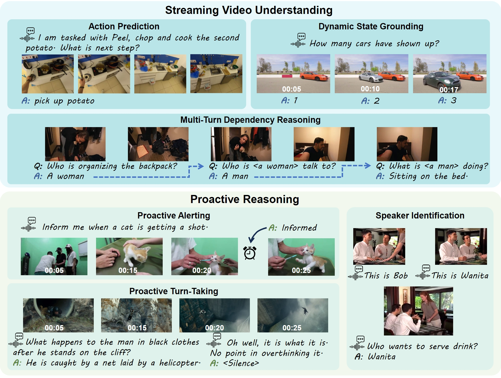

<h1 align="center">OmniMMI: A Comprehensive Multi-modal Interaction Benchmark in Streaming Video Contexts</h1>
<p align="center">
    <a href="https://arxiv.org/abs/xxxx.xxxxx">
            
    </a>
    <a href="https://huggingface.co/datasets/ColorfulAI/OmniMMI">
        
    </a>
    <a href="https://omnimmi.github.io">
        
    </a>
</p>

<!-- [](https://<CONFERENCE>) -->




**Table of Contents**

- [OmniMMI](#omnimmi)
  - [Introduction](#introduction)
  - [Statistics](#statistics)
  - [Data](#data)
- [Evaluation](#evaluation)
  - [Installation](#installation)
  - [Usage](#usage)
- [Leaderboard](#leaderboard)

## OmniMMI

### Introduction

we introduce OmniMMI, a comprehensive multi-modal interaction benchmark tailored for OmniLLMs in streaming video contexts. OmniMMI encompasses over 1,121 real-world interactive videos and 2,290 questions, addressing two critical yet underexplored challenges in existing video benchmarks: streaming video understanding and proactive reasoning, across six distinct subtasks.

- **Streaming Temporal State Awareness**.  Streaming video understanding must build an understanding w.r.t. the current and historical temporal state incrementally, without accessing the future context. This contrasts with traditional MLLM that can leverage the entire multi-modal contexts, posing challenges in our distinguished tasks of action prediction (AP), state grounding (SG) and multi-turn dependencies (MD).
- **Proactive Reasoning and Turn-Taking**. Generating responses proactively and appropriately anticipating the turn-taking time spot w.r.t. user's intentions and dynamic contexts is a crucial feature for general interactive agents. This typically requires models to identify speakers (SI), distinguish between noise or legitimate query (PT), and proactively initiate a response (PA).

### Statistics

| **Statistic** | **SG** | **AP** | **MP** | **PT** | **PA** | **SI** |
| ------------------- | ------------ | ------------ | ------------ | ------------ | ------------ | ------------ |
| Videos              | 300          | 200          | 300          | 78           | 200          | 200          |
| Queries             | 704          | 200          | 786          | 200          | 200          | 200          |
| Avg. Turns          | 2.35         | 1.00         | 2.62         | 1.00         | 1.00         | 1.00         |
| Avg. Vid.(s)        | 350.82       | 234.95       | 374.80       | 2004.10      | 149.82       | 549.64       |
| Avg. Que.           | 16.00        | 25.99        | 26.27        | 8.45         | 17.49        | 60.91        |

### Data

You can download the OmniMMI from [huggingface](https://huggingface.co/datasets/ColorfulAI/OmniMMI), containing both json and raw videos.

```
videohallucer_datasets                  
    ├── clips/
    ├── videos/
    ├── action_prediction.json
    ├── dynamic_state_grounding.json
    ├── multiturn_dependency_reasoning.json
    ├── proactive_alerting.json
    ├── proactive_turntaking.json
    └── speaker_identification.json
  
```

We offer a selection of data samples (multiturn dependency reasoning) from our dataset for further elucidation:

```
[
    {
        "video": "jGM8EImhpXg.mp4",
        "qa": [
            {
                "question": "What is the task of the instruction video?",
                "answer": "Cook Omelet",
                "timestamp": "0.0 -- 36.0"
            },
            {
                "question": "What's the first step of ##ANSWER##?",
                "answer": "Pouring the egg into the pot",
                "timestamp": "36.0 -- 40.0"
            },
            {
                "question": "What do you do after the step from ##ANSWER##?",
                "answer": "fry eggs",
                "timestamp": "41.0 -- 70.0"
            }
        ]
    },
...
]
```

## Evaluation

 *If you want to upload results from your models, feel free to submit a PR following one of these baselines, or send an email to me (flagwyx@gmail.com) to update your results on our page.*

### Installation

**Available Baselines**

Large Video Language Model

- VideoChatGPT-7B
- VideoChat2-7B
- Video-LLaVA-7B
- LLaMA-VID-7B/13B
- MiniGPT4-Video-7B
- PLLaVA-7B/13B/34B
- LLaVA-NeXT-Video-DPO-DPO-7B/34B
- ShareGPT4Video-8B
- LongVA-7B
- LongVILA-8B
- LongLLaVA-9B
- VideoLLM-online-8B
- VideoLLaMB-7B
- InternLM-XComposer-2.5-OmniLive-1.5B
- Gemini-1.5-pro
- GPT4O (Azure)

Large Omni Language Model

- VideoLLaMA2-7B
- VITA-7B
- MiniOmni2-0.5B
- M4-7B

For detailed instructions on installation and checkpoints, please consult the [INSTALLATION](INSTALLATION.md) guide.

### Usage

debug inference pipeline

```bash
cd baselines
python ../model_testing_zoo.py --model_name Gemini-1.5-pro # ["VideoChatGPT", "VideoChat2", "VideoLLaVA", "LLaMA-VID", "PLLaVA", "PLLaVA-13B", "PLLaVA-34B", "LLaVA-NeXT-Video", "LLaVA-NeXT-Video-34B", "LongVA", "LongVILA", "LongLLaVA", "VideoLLaMB", "VideoOnline", "VideoLLaMBOneline", "Gemini-1.5-pro", "GPT4O"])
```

#### 1. evaluate on OmniMMI at one step

```bash
cd baselines
bash run_all.sh
bash eval_all.sh
```

#### 2. evaluate step by step

for each evaluation script for specific subtask, e.g. `run_ap.sh`

2.1 set the model and conda environment

```bash
model_names=("LongVA" "PLLaVA-13B")
environments=("llongva" "pllava")
```

There are two groups of models
(i) common models

```
"MiniGPT4-Video" "VideoChatGPT" "VideoLLaVA" "VideoChat2" "LLaMA-VID" "PLLaVA" "LLaVA-NeXT-Video" "ShareGPT4Video" "PLLaVA-13B" "PLLaVA-34B" "LLaVA-NeXT-Video-34B" "LongVA" "LongVILA" "LongLLaVA" "VideoLLaMB" "InternLMXCO" "InterSuit" "InterSuitAV"
```

(ii) online models

```
"VideoOnline" "VideoLLaMBOnline" "InterSuitOnline" "InterSuitOnlineAV"
```

2.2 set the conda environment path

```bash
source ~/scratch/anaconda3/bin/activate
```

2.3 run the evaluation script for each subtask

```bash
cd baselines
bash run_ap.sh # action prediction
bash eval_ap.sh
```

## Leaderboard

### Leaderboard of Large Video Language Model

| Models               | LLM        | Num Frames | SG avg. | AP    | MD avg. | SI    | PA    | PT    | avg. w/o P |
| -------------------- | ---------- | ---------- | ------- | ----- | ------- | ----- | ----- | ----- | ---------- |
| Gemini-1.5-Pro       | -          | 128        | 16.33   | 43.00 | 12.00   | 38.50 | ✗    | ✗    | 27.46      |
| GPT-4o               | -          | 50         | 15.00   | 39.50 | 12.33   | 17.00 | ✗    | ✗    | 20.96      |
| IXC2.5-OL            | Qwen2-1.5B | 512        | 4.03    | 30.50 | 4.00    | 23.00 | ✗    | 14.50 | 15.04      |
| LongVILA             | Llama3-8B  | 128        | 4.33    | 39.00 | 3.00    | 10.00 | ✗    | ✗    | 14.21      |
| M4                   | Qwen2-7B   | 32 / 1 fps | 5.67    | 35.67 | 1.67    | 9.00  | 25.50 | 62.00 | 12.46      |
| LongVA               | Qwen2-7B   | 32         | 3.33    | 33.33 | 2.33    | 3.00  | ✗    | ✗    | 11.54      |
| LongLLaVA            | Jamba-9B   | 128        | 3.33    | 29.00 | 3.67    | 10.00 | ✗    | ✗    | 11.50      |
| LLAMA-VID-13B        | Vicuna-13B | 128        | 1.33    | 30.50 | 3.33    | 8.50  | ✗    | ✗    | 10.91      |
| VideoChatGPT         | LLama-7B   | 100        | 3.33    | 33.35 | 3.00    | 3.50  | ✗    | ✗    | 10.83      |
| LLAMA-VID            | Vicuna-7B  | 128        | 2.33    | 29.00 | 2.67    | 7.50  | ✗    | ✗    | 10.38      |
| VideoLLM-online      | Llama3-8B  | 1 fps      | 4.67    | 35.00 | 1.33    | 5.00  | ✗    | ✗    | 10.25      |
| PLLAVA-34B           | Yi-34B     | 16         | 3.67    | 25.00 | 3.00    | 5.00  | ✗    | ✗    | 10.04      |
| PLLAVA-13B           | Vicuna-13B | 16         | 2.67    | 25.00 | 4.33    | 6.50  | ✗    | ✗    | 9.62       |
| LLAVA-NeXT-Video-34B | Yi-34B     | 32         | 2.67    | 30.50 | 1.67    | 1.50  | ✗    | ✗    | 9.59       |
| VideoLLAMB           | Vicuna-7B  | 32 / 1 fps | 2.33    | 29.50 | 3.00    | 3.00  | ✗    | ✗    | 9.46       |
| PLLAVA               | Vicuna-7B  | 16         | 3.33    | 30.00 | 1.33    | 3.00  | ✗    | ✗    | 9.41       |
| ShareGPT4Video       | Llama3-8B  | 16         | 2.00    | 29.00 | 2.00    | 4.50  | ✗    | ✗    | 9.38       |
| LLAVA-NeXT-Video     | Vicuna-7B  | 32         | 3.00    | 30.50 | 3.00    | 1.50  | ✗    | ✗    | 9.25       |
| Video-LLaVA          | Vicuna-7B  | 8          | 1.67    | 28.00 | 2.00    | 1.50  | ✗    | ✗    | 9.25       |
| VideoChat2           | Vicuna-7B  | 8          | 2.33    | 27.50 | 2.67    | 1.00  | ✗    | ✗    | 8.38       |
| MiniGPT4-Video       | Mistrl-7B  | 45         | 4.00    | 23.00 | 1.67    | 1.00  | ✗    | ✗    | 7.92       |

### Leaderboard of Large Omni Language Model

| Models      | LLM          | Num Frames | SG avg. | AP    | MD avg. | SI   | PA   | PT    | avg. w/o P |
| ----------- | ------------ | ---------- | ------- | ----- | ------- | ---- | ---- | ----- | ---------- |
| VideoLLaMA2 | Qwen2-7B     | 8          | 10.33   | 35.00 | 3.00    | 5.00 | ✗   | ✗    | 13.33      |
| VITA        | Mistrl-8×7B | 16         | 0.00    | 39.00 | 2.00    | 1.50 | ✗   | 67.00 | 10.62      |
| M4-audio    | Qwen2-7B     | 32 / 1 fps | 2.00    | 13.00 | 3.00    | 7.50 | 1.50 | 68.50 | 6.38       |
| MiniOmni2   | Qwen2-0.5B   | 1          | 4.67    | 14.00 | 1.00    | 1.00 | ✗   | ✗    | 5.17       |

Please check the detailed leaderboard in our [page](https://omnimmi.github.io)

## Citation

If you find our work helpful, please consider citing it.

```bibtex
@article{omnimmi,
    title={OmniMMI: A Comprehensive Multi-modal Interaction Benchmark in Streaming Video Contexts},
    author={Wang, Yuxuan and Wang, Yueqian and Chen, Bo and Wu, Tong and Zhao, Dongyan and Zheng, Zilong},
    journal={arxiv},
    year={2025}
}
```
